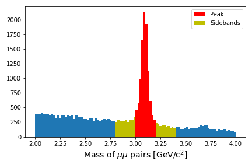

:::::::::::::::::::::::::::::::::::::: questions 

- Can we use the actual data to estimate backgrounds?
- What are the downsides to this approach?

::::::::::::::::::::::::::::::::::::::::::::::::

::::::::::::::::::::::::::::::::::::: objectives

- Learn to use the simplest sideband approach to estimating backgrounds
- Recognize how this might be extended to more complicated approaches

::::::::::::::::::::::::::::::::::::::::::::::::

## Introduction

There is a significant amount of code to run here and so we have written the majority of it in a Jupyter notebook. 
You can run most of the code on its own, but you should take the time to read and understand what is happening. 
In some places, you need to modify the code to get it to run. 

First, start your python docker container, following the lessons from 
[the pre-exercises](https://cms-opendata-workshop.github.io/workshop2024-lesson-docker/instructor/03-docker-for-cms-opendata.html). 
I am on a Linux machine, and I have already created the `cms_open_data_python` directory. So I will do the following

```bash
export workpath=$PWD
mkdir cms_open_data_python
chmod -R 777 cms_open_data_python
```

Start the container with

```bash
docker run -it --name my_python -P -p 8888:8888 -v ${workpath}/cms_open_data_python:/code gitlab-registry.cern.ch/cms-cloud/python-vnc:python3.10.5
```

You will get a container prompt similar this:

```output
cmsusr@4fa5ac484d6f:/code$
```

Before we start our Jupyter environment, let's download the notebook we'll be using with the following command. 

```bash
wget XXXX
```

Now I will start Jupyter lab as follows. 

```bash
jupyter-lab --ip=0.0.0.0 --no-browser
```

and open the link that is printed out in the message.

:::::::::::::::: testimonial

## How to follow this lesson

While some of the code will be explained on this web page, the majority of the code
*and explanations of the code* are written out in the Jupyter notebook. Therefore, 
you should primarily following along there. 

I will use this webpage for the lesson to provide guideposts and checkpoints
that we can refer to as we work through the lesson.

:::::::::::::::::


## Data-driven background estimation

### Preparing the environment

We will be making use of the `pandas` and `Hist` python libraries.

* [Pandas](https://pandas.pydata.org/)
* [Hist](https://hist.readthedocs.io/en/latest/)

The first part of the notebook 
**Install and upgrade libraries** asks you to do just that, in order to ensure a consistent
environment. 

Depending on your connection, it should take less than 1 minute to upload and import the libraries. 

### Sideband estimation

Suppose you are studying the production of $J/\psi$ mesons and you are able to reconstruct the invariant mass 
of muon pairs. Sometimes those muon pairs come from the decay of $J/\psi$ but they might come from any number
of other processes. 

You are not interested in exactly what those background processes are, you only want to know
*how many $J/\psi$ mesons are in your dataset*.

There are sophisticated ways to fit the data distribution but we will do something simpler. We will estimate the
amount of background events "under" the peak and then subtract that from the signal region to get an estimate
of the number of events. 

The figure below shows a graphical representation of the sidebands relative to your peak. 

{alt='A plot of the invariant mass of muon pairs from CMS open data showing the $J\psi$ peak on a falling background.'}

Run through the notebook to walk through this exercise.

::::::::: challenge

## Can you do better?

The example in the notebook leads to an estimate of 7745.5 $J/\psi$ events in the dataset. However, the values we chose are maybe not perfectly centered
on the peak. Does it matter? Can you play around with the definitions of the signal region or sideband region to come up with a different
estimate. 

Put your own estimates for the number of $J/\psi$ mesons in the Zoom chat or Mattermost discussion.

:::::::::::

This simple sideband approach can be extended to something referred to as the [ABCD](https://cms-opendata-guide.web.cern.ch/analysis/backgrounds/#abcd-method)
which extends the sidebands into some 2-dimensional kinematic region.

::::::::::::::::::::::::::::::::::::: keypoints 

- The simplest data-driven approach to background estimates is the sideband approach
- This can be good enough for a first-order estimate when there is an obvious peak

::::::::::::::::::::::::::::::::::::::::::::::::

[r-markdown]: https://rmarkdown.rstudio.com/
