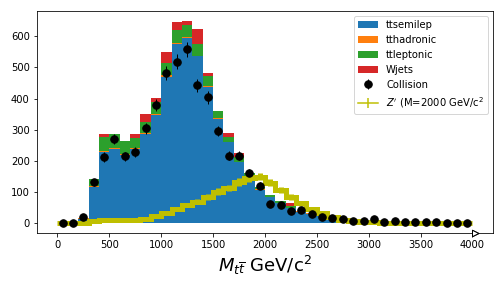

:::::::::::::::::::::::::::::::::::::: questions 

- How can we use our simulation samples to estimate our background?
- Can we use our simulation samples "as-is"?

::::::::::::::::::::::::::::::::::::::::::::::::

::::::::::::::::::::::::::::::::::::: objectives

- Learn to use simulation samples to estimate background
- Understand how weights are used to compare data and simulation
- Make a plot to compare our simulations of background samples to the collision data

::::::::::::::::::::::::::::::::::::::::::::::::

## Introduction

At the end of this lesson, you'll have a plot similar to the Higgs plot at the start of this lesson, 
in which you compare the background and signal Monte Carlo to the collision data and try to determine
if there is an obvious signal in the dataset.

You'll be walking through the Jupyter notebook to do this, but first we want to introduce
the idea of scaling your Monte Carlo and how generator weights come into play. 

You can also read more about background estimation at the [CMS Open Data Guide chapter on this topic](https://cms-opendata-guide.web.cern.ch/analysis/backgrounds/)

### Cross sections

It is worth reminding ourselves of the meaning of cross sections and integrated luminosity. 

*Instantaneous luminosity* is effectively a measure of how many protons pass close enough to the other proton bunches that 
they might interact in some time interval. You can think of it as the "brightness" of our beams.

*Integrated luminosity* ($\mathcal{L}$) is the sum of all of those potential interactions. Effectively, it refers to the amount of collected data. 

*Cross sections* ($\sigma$) are related to the probability of a particular process, either production or decay, occurring. 

From this, we can get the expected number of events $N$.

$$N = \sigma \times \mathcal{L}$$

### Scaling Monte Carlo

We often overproduce our Monte Carlo so that we have more than there would be in data. This reduced the statistical uncertainty
that might come from small samples after they are reduced by our selection cuts. 

So if we want to compare our Monte Carlo simulation samples to the collision data, we need to know what the cross section is for those processes, 
We can calculate the expected number of events ($N_{exp}$) from the above equation and then scale our produced number of events ($N_{gen}$) to get the 
weight, for that dataset. 

$$\textrm{weight} = \frac{N_{exp}}{N_{gen}}$$
$$\textrm{weight} = \frac{\sigma \times \mathcal{L}}{N_{gen}}$$

### Monte Carlo weights

When Monte Carlo events are generated, there is a weight associated with each event that is an output of the particular generator. 
Because you might want a lot of simulated events generated in a region of phase space that is normally sparsely populated, you need a way
to effectively normalize the full simulated dataset. 

Depening on the generator, you might sometimes get *negative weights*. When we scale everything, we count up the number of events
with positive weight and subtract from it the number of events with negative weights. For the Monte Carlo samples we are using for this lesson, 
we have almost no events with negative weights, but it is good to know this for future analyses. 

## Final plot

If you are able to get through your Jupyter notebook, you should wind up with a plot that compares the simulation with the collision data.

It's pretty good agreement, just from scaling things! For the next sections, you'll learn how to use more sophisticated inference tools to 
estimate the upper-limit on the $Z'$ production cross section. 

{alt='A plot of the ttbar invariant mass from our analysis with simulation and collision data labeled.'}

::::::::::::::::::::::::::::::::::::: keypoints 

- Awkward arrays allow for a simplified syntax when making cuts to select the data
- You need to be careful to distinguish between cuts on events and cuts on particles

::::::::::::::::::::::::::::::::::::::::::::::::

[r-markdown]: https://rmarkdown.rstudio.com/
