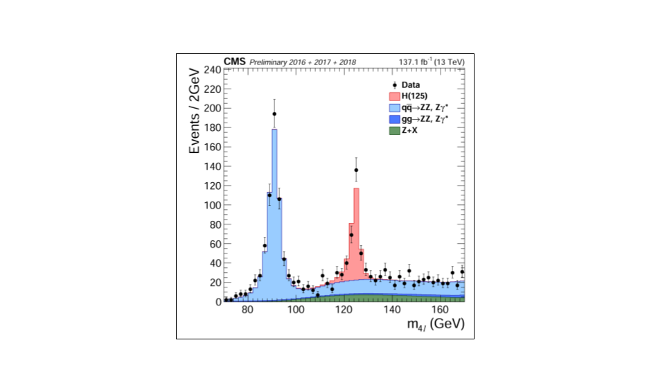
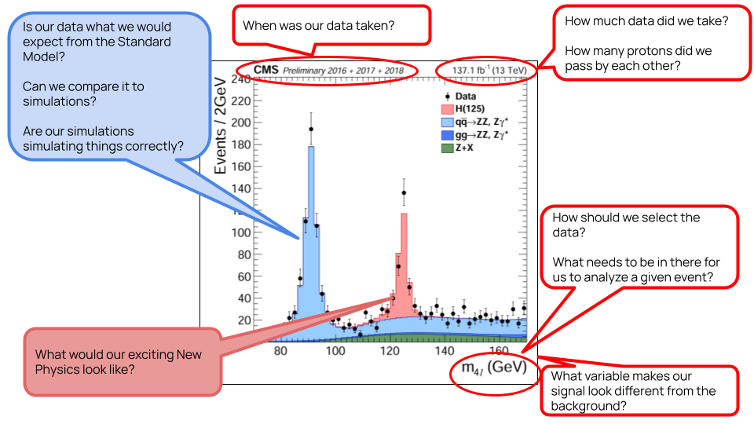

:::::::::::::::::::::::::::::::::::::: questions 

- What do we mean when we say "backgrounds"?
- Are all backgrounds the same?
- What do we mean by "model backgrounds"?

::::::::::::::::::::::::::::::::::::::::::::::::

::::::::::::::::::::::::::::::::::::: objectives

- To develop an understanding of the terms, like background modeling

::::::::::::::::::::::::::::::::::::::::::::::::

## Introduction
As a reminder, we're going to reproduce parts of a 2019 CMS study for resonant production of 
top-antitop pairs. The paper can be found [here](https://arxiv.org/pdf/1810.05905) and
hypothesizes a particle with specific properties referred to as $Z'$ which is
produced in our proton-proton collisions and then decays to a top-antitop pair. 

$$p p \rightarrow Z' \rightarrow t\overline{t}$$

 of M. Missiroli "Searches for top-antitop quark resonances in semileptonic final states with the CMS detector"](fig/boosted_top_decay.png){alt='Two diagrams showing a top quark and antitop quark being produced where one decays through a leptonic process and the other decays through a hadronic process. The first image shows the hadronic decay in a non-boosted state and the second image shows the hadronic jets overlapping because of the boosted nature of the decay.'}

A challenge is that there are standard model processes than can produce the same final 
state objects and can mimic our signal. We have chosen selection criteria such that the kinematics
are different from our signal, but we can't entirely eliminate all the standard model processes 
and so we need to estimate how much of the remaining collision data can be explained by these background processes. 

## Backgrounds

In particle physics we are usually either a) searching for new physics or b) trying to make a precise measurement of some standard model process. 

In the case of the former, we can almost never entirely get rid of all the standard model processes. In the case of the latter, we can almost never
get rid of all the *other* standard model processes that are not the one we're interested in. In both cases, these remaining data are referred to 
as **backgrounds**. 

Backgrounds can come in different forms. 

* Standard model processes that produce the same final state as what we are interested in
* Mistakes in how we reconstruct our physics objects such that it *looks* like we have the same final state

The first case is usually what we are dealing with at the LHC experiments. 

For example, let's look at this plot showing a Higgs measurement (formerly a Higgs discovery!). This type of plot is ubiquitous in high 
energy physics analysis. It shows a stacked histogram of Monte Carlo (simulation) for the signal (Higgs) and background processes, 
compared with the collision data overlaid. 

It is obvious that without the inclusion of the Higgs hypothesis we would not be able to fully describe these data.

{alt='Plot of 4-lepton final state from CMS showing Higgs peak'}

Now let's step back and take a look at everything that went into this plot! While we are not going to go through *all* of this, 
we draw your attention to the comments about the standard model processes: our backgrounds. Since we are working our way through
an exercise where we search for signs of new physics, understanding our background contributions is incredibly important. 

{alt='Plot of 4-lepton final state from CMS showing Higgs peak with some text describing what goes into this plot.'}

### Background processes for our analysis

As a reminder, 
we will concern ourselves with four (4) physics processes that might mimic our signal and which we identify as possible *backgrounds*.

* Production of a top-quark pair that decays *semileptonically*
* Production of a top-quark pair that decays *hadronically*
* Production of a top-quark pair that decays *leptonically*
* Production of $W$ bosons in association with jets and when the $W$ bosons decay leptonically

We made some cuts on the data to reduce these contributions quite a bit, but we can't get rid of them
entirely. 

For our analysis, we will use our simulations to estimate the amount that these contribute to the final
dataset. But first, let's walk through a simple example of *data-driven background estimation*. 

::::::::::::::::::::::::::::::::::::: keypoints 

- Backgrounds can manifest in your analysis for different reasons
- It's almost impossible to eliminate all backgrounds in collider experiments

::::::::::::::::::::::::::::::::::::::::::::::::

[r-markdown]: https://rmarkdown.rstudio.com/
